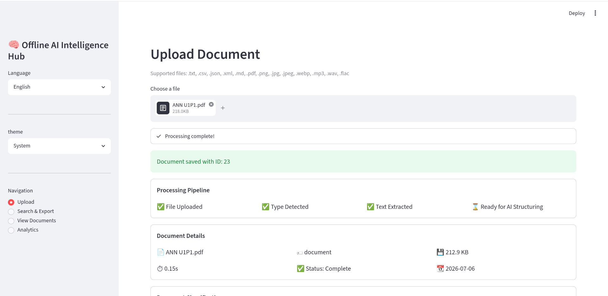
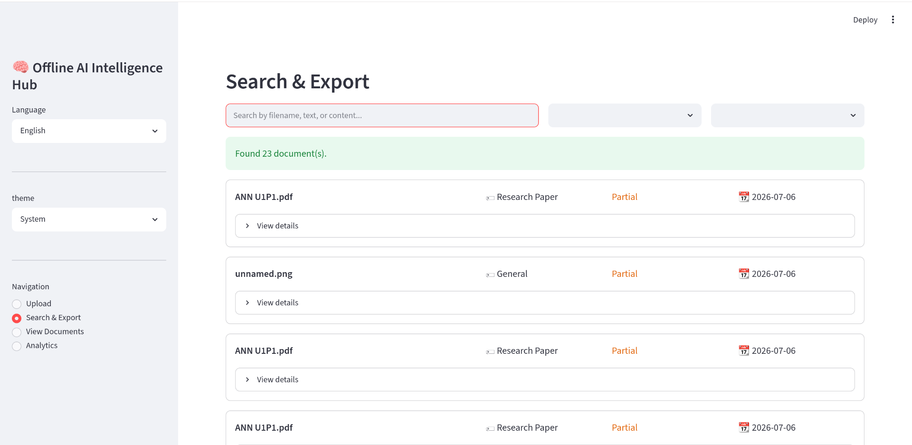
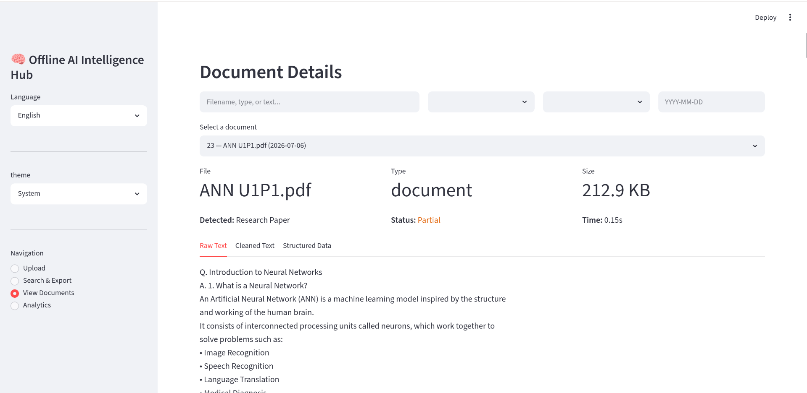
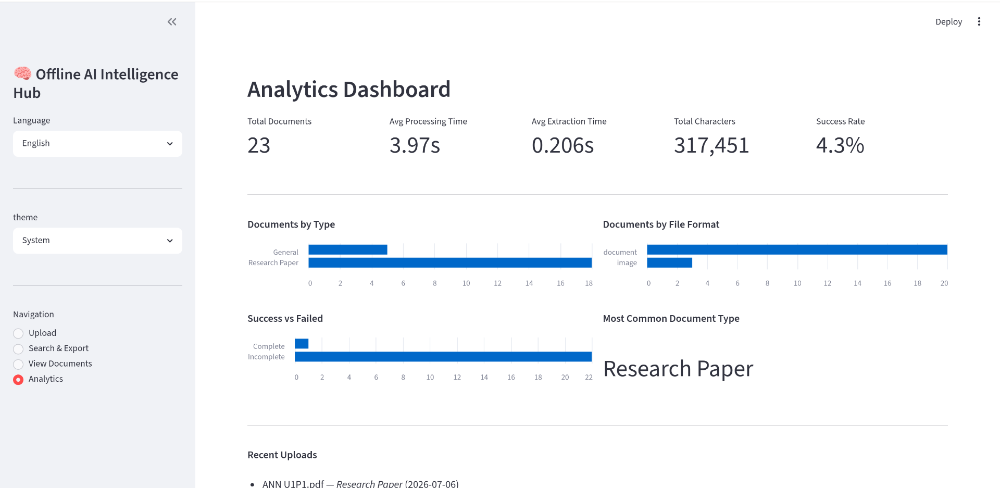
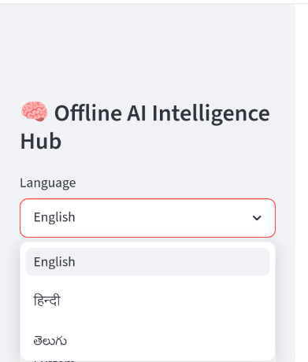
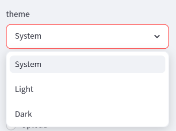

# 🧠 Offline AI Intelligence Hub

An **offline-first intelligent document processing system** built with **Streamlit** that extracts, classifies, analyzes, searches, and exports information from uploaded documents. The application is designed to work completely offline and supports OCR, document analytics, multilingual UI, and optional local AI inference using Ollama.

---

# ✨ Features

## 📂 Document Upload

- Upload multiple document formats
- Automatic file type detection
- File size validation
- Secure local storage

Supported Formats

- PDF
- PNG
- JPG
- JPEG
- TXT
- DOCX
- WAV
- MP3

---

## 🔍 OCR & Text Extraction

Automatically extracts text using:

- PyMuPDF (PDF)
- Tesseract OCR (Images)
- Faster Whisper (Audio)

---

## 🧹 Text Processing

- Text cleaning
- Noise removal
- Unicode normalization
- Empty line removal

---

## 📑 Document Classification

Automatically identifies document types such as:

- Invoice
- Resume
- Medical Report
- Meeting Notes
- Research Paper
- Generic Document

---

## 🤖 Offline AI Integration

Supports:

- Ollama
- Llama 3.2

Features:

- Local inference
- Structured JSON extraction
- Graceful fallback when Ollama is unavailable
- No cloud APIs

---

## 📊 Analytics Dashboard

Provides insights including:

- Total documents
- Document types
- File types
- Processing status
- Performance metrics
- Recent uploads

---

## 🔎 Search

Search documents by:

- Filename
- Document type
- File type
- Processing status
- Keywords

---

## 📤 Export

Export extracted information as:

- JSON
- CSV
- TXT

---

## 🌍 Internationalization

Supported Languages

- 🇺🇸 English
- 🇮🇳 Hindi
- 🇮🇳 Telugu

Only the application UI is translated.

Uploaded document content remains unchanged.

---

## 🎨 Theme Support

- Light
- Dark
- System

User preference is remembered during the session.

---

## ⚡ Performance Metrics

Tracks:

- Extraction time
- OCR time
- AI inference time
- Total pipeline time
- CPU usage
- Memory usage

---

# 🏗 Project Structure

```text
offline-ai-intelligence-hub/
│
├── app.py
├── config.py
├── schemas.py
│
├── ingestion/
│   ├── extractor.py
│   └── upload.py
│
├── processing/
│   ├── cleaner.py
│   ├── classifier.py
│   ├── detector.py
│   └── processor.py
│
├── storage/
│   ├── database.py
│   └── models.py
│
├── llm/
│   ├── local_llm.py
│   └── prompts.py
│
├── pipeline/
│   └── export.py
│
├── ui/
│   ├── components/
│   └── pages/
│
├── utils/
│
├── i18n/
│   ├── translator.py
│   └── translations.py
│
├── tests/
│
├── uploads/
├── exports/
├── requirements.txt
├── requirements-dev.txt
├── Dockerfile
├── docker-compose.yml
├── .gitlab-ci.yml
└── README.md
```

---

# 🛠 Technologies Used

## Frontend

- Streamlit

## Backend

- Python 3.13

## Database

- SQLite

## OCR

- PyMuPDF
- Pillow
- Tesseract OCR

## Audio Processing

- Faster Whisper

## Local AI

- Ollama
- Llama 3.2

## Development Tools

- Ruff
- Pre-commit
- Pytest
- Coverage
- GitLab CI/CD

---

# 🚀 Installation

## Clone Repository

```bash
git clone <repository-url>
cd offline-ai-intelligence-hub
```

---

## Create Virtual Environment

```bash
python -m venv venv
```

Linux/macOS

```bash
source venv/bin/activate
```

Windows

```bash
venv\Scripts\activate
```

---

## Install Dependencies

```bash
pip install -r requirements-dev.txt
```

---

## Run Application

```bash
streamlit run app.py
```

---

# 🐳 Docker

Build

```bash
docker build -t offline-ai-intelligence-hub .
```

Run

```bash
docker-compose up
```

---

# 🧪 Testing

Run Ruff

```bash
ruff check .
```

Format

```bash
ruff format .
```

Run Pre-commit

```bash
pre-commit run --all-files
```

Run Tests

```bash
pytest
```

Coverage

```bash
coverage run -m pytest
coverage report
```

---

# 🏛 Architecture

```text
User
   │
   ▼
Upload Document
   │
   ▼
File Validation
   │
   ▼
Text Extraction
(PDF / OCR / Audio)
   │
   ▼
Text Cleaning
   │
   ▼
Document Classification
   │
   ▼
AI Structuring (Optional via Ollama)
   │
   ▼
SQLite Storage
   │
   ├────────► Search
   ├────────► Analytics
   ├────────► Viewer
   └────────► Export
```

---

# 🔄 Offline AI Workflow

```text
Document
      │
      ▼
OCR / Extraction
      │
      ▼
Cleaning
      │
      ▼
Classification
      │
      ▼
Ollama Available?
      │
 ┌────┴────┐
 │         │
Yes       No
 │         │
 ▼         ▼
AI JSON   Graceful Fallback
 │         │
 └────┬────┘
      ▼
SQLite Database
```

---

# 📸 Application Screenshots

## Home


---

## Upload



---

## Search



---

## Document Viewer



---

## Analytics Dashboard



---

## Language Selection



---

## Theme Selection


---

# 🔮 Future Improvements

- Chat with uploaded documents
- Semantic vector search
- RAG pipeline
- Batch document processing
- Local embeddings
- Multi-user authentication
- Role-based access
- Offline summarization
- Document comparison
- Voice interaction

---

# 🤝 Contributing

1. Fork the repository

2. Create a feature branch

```bash
git checkout -b feature/new-feature
```

3. Commit changes

```bash
git commit -m "Add new feature"
```

4. Push changes

```bash
git push origin feature/new-feature
```

5. Create a Merge Request

---

# 📄 License

This project is licensed under the MIT License.

---

# 👨‍💻 Author

**T V S K Gautham Sainath Tilak & G Aravind kumar Goud**

CSE (AI & ML)

Offline AI Intelligence Hub – Hackathon Project
